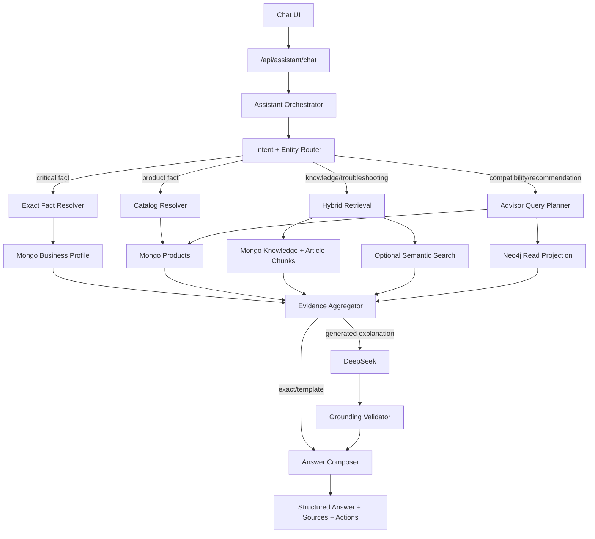

# Tiến Đạt Audio — Assistant, Knowledge Base và Knowledge Graph Plan

**Trạng thái:** Production `graph_shadow` active — graph/advisor public rollout pending security and evaluation gates
**Cập nhật:** 2026-08-13
**Phạm vi:** Public chatbot, admin knowledge center, MongoDB knowledge domain, Neo4j projection, retrieval/evaluation và production rollout.
**Nguồn thiết kế:** plan MongoDB + Neo4j do repository owner cung cấp, source hiện tại và `docs/ARCHITECTURE_STANDARD.md`.

## 1. Mục tiêu

Xây một trợ lý âm thanh có thể:

- trả lời tuyệt đối chính xác các dữ kiện doanh nghiệp như điện thoại, email, địa chỉ và giờ mở cửa;
- tìm đúng dữ liệu sản phẩm hiện hành từ MongoDB;
- trả lời kiến thức kỹ thuật từ nội dung đã xuất bản và kho tri thức đã được duyệt;
- hỏi lại khi thiếu diện tích, ngân sách, nhu cầu hoặc thiết bị đang sở hữu;
- tư vấn phối ghép bằng quan hệ, claim và compatibility đã có evidence;
- luôn chỉ ra nguồn, mức tin cậy và hành động tiếp theo;
- tiếp tục hoạt động ở chế độ giảm cấp khi DeepSeek, semantic search hoặc Neo4j không sẵn sàng.

Mục tiêu quan trọng nhất không phải câu trả lời “nghe hay”, mà là **đúng dữ liệu, truy nguyên được và không bịa**.

## 2. Baseline đã xác minh

Tại thời điểm lập plan:

- Stack production là Next.js 15 App Router, React 19, TypeScript, MongoDB Community 8 tự host, Nginx và systemd.
- MongoDB production bind loopback và là source of truth.
- Chatbot public đang dùng `/api/assistant/chat`, DeepSeek và widget `AssistantWidget`.
- Retrieval hiện tại chỉ nạp tối đa 500 sản phẩm và 100 bài editorial public.
- Retrieval dùng lexical substring scoring và trả tối đa 5 documents.
- Business Profile nằm trong `site_settings` nhưng chưa được đưa vào assistant.
- Câu hỏi về số điện thoại đã bị retrieval kéo về các bài kỹ thuật không liên quan.
- Product hiện chỉ có `inStock: boolean`; hệ thống chưa sở hữu stock quantity realtime.
- Admin mutation hiện dùng `requireAdmin`; content đã có revision/version workflow có thể tái sử dụng.
- CI/CD dùng immutable release, atomic symlink, healthcheck và automatic rollback.

### Root cause của lỗi contact

```text
Question: “Số điện thoại liên hệ là gì?”
        ↓
Lexical retrieval trên Products + Articles
        ↓
Không có Business Profile trong corpus
        ↓
Tìm nhầm article có từ chung
        ↓
Không đủ evidence hoặc model có nguy cơ suy diễn
```

Lỗi này phải được sửa bằng routing/resolver, không chỉ bằng prompt.

## 3. Phạm vi và non-goals

### Trong phạm vi

- Exact-fact resolver.
- Intent routing và entity/constraint extraction.
- Curated Knowledge Base có review/publish/revision.
- Article chunking và retrieval có authority/confidence.
- Claim, source và compatibility assessment.
- Neo4j knowledge projection và graph retrieval.
- Structured answer contract và conversation state.
- Admin Knowledge Center, evaluation và observability.
- Production rollout có feature flag, health, backup và rollback.

### Ngoài phạm vi V1

- Kafka, Kubernetes, Elasticsearch, Qdrant hoặc multi-agent swarm.
- LLM tự viết Cypher rồi chạy production.
- AI tự publish knowledge/claim/compatibility.
- Neo4j lưu giá, stock hoặc business contact làm source of truth.
- User account/social graph.
- Voice bot, call center automation hoặc auto-send Zalo.
- Recommendation dựa trên rating/review giả hoặc dữ liệu chưa được xác minh.

## 4. Quyết định kiến trúc bắt buộc

### A1 — MongoDB là source of truth

MongoDB sở hữu:

- Business Profile và cấu hình assistant.
- Products, price hiển thị, `inStock`, specifications và media.
- Posts/editorial/social content và trạng thái publish.
- Curated knowledge, claims, sources và compatibility assessments.
- Chat sessions, messages, feedback và evaluation results.

Neo4j là projection có thể xóa/rebuild từ MongoDB. Không có admin UI nào ghi Neo4j trực tiếp.

### A2 — Critical facts không đi qua LLM

Các intent sau dùng deterministic resolver:

- `business_contact`
- `business_location`
- `business_hours`
- `business_identity`
- `product_price`
- `product_availability`
- `product_specification`

DeepSeek không được sửa, định dạng lại theo cách làm thay đổi hoặc thay thế các dữ kiện này.

### A3 — Neo4j là optional dependency

Nếu Neo4j lỗi:

- business/contact exact facts vẫn hoạt động;
- product lookup vẫn đọc MongoDB;
- curated/article retrieval vẫn hoạt động bằng lexical search;
- recommendation cần graph sẽ chuyển thành clarification/fallback;
- website và API health tổng thể không được sập chỉ vì graph unavailable.

### A4 — Không dual-write

```text
Admin/API → MongoDB transaction/write → sync state/outbox → Graph worker → Neo4j
```

Không làm:

```text
Admin/API → MongoDB
          └→ Neo4j trực tiếp
```

### A5 — Không arbitrary Cypher

Application chọn typed query template. Input người dùng chỉ trở thành typed parameters đã validate, không trở thành Cypher string.

### A6 — AI extraction chỉ tạo suggestion

AI-extracted entities, relations và claims luôn có `reviewStatus: suggested`. Chúng không được dùng làm fact/recommendation cho tới khi người thật duyệt.

### A7 — Verification và confidence là hai trục khác nhau

```ts
type ReviewStatus = 'suggested' | 'review' | 'verified' | 'rejected' | 'archived'

type EvidenceState = {
  reviewStatus: ReviewStatus
  confidence: number
}
```

`confidence: 0.99` không thay thế `reviewStatus: verified`.

### A8 — Không phụ thuộc sớm vào vector provider

Production hiện dùng MongoDB Community tự host, vì vậy không giả định có MongoDB Atlas Vector Search. Application dùng `SemanticSearchPort`; lexical retrieval là baseline. Vector adapter chỉ được bật sau capability/cost/quality gate.

## 5. Kiến trúc tổng thể



## 6. Ownership và authority

| Data | Source of truth | Retrieval authority | Có vào Neo4j? | LLM được sửa? |
| --- | --- | ---: | --- | --- |
| Phone/email/address/hours | `site_settings.business_profile` | 100 | Projection optional | Không |
| Product name/spec/price/inStock | `products` | 95 | ID/relation only | Không |
| Curated policy/FAQ/service | `assistant_knowledge_entries` | 90 | Có | Chỉ diễn giải |
| Verified claim | `knowledge_claims` | 90 | Có | Chỉ diễn giải |
| Compatibility assessment | `compatibility_assessments` | 90 | Có | Chỉ diễn giải |
| Published editorial | `posts` | 70 | Article/chunk relation | Có, với citation |
| Published social post | `posts` | 40 | Không mặc định | Chỉ tham khảo |
| AI suggestion | Mongo suggestion queue | 0 trước review | Không public | Không dùng |

Khi hai nguồn mâu thuẫn, nguồn authority cao hơn thắng và conflict phải được log để admin xử lý.

## 7. Clean Architecture target

Giữ module hiện có và mở rộng theo dependency rule của dự án:

```text
src/modules/
├── assistant/
│   ├── domain/
│   │   ├── assistant-message.domain.ts
│   │   ├── assistant-intent.domain.ts
│   │   ├── assistant-answer.domain.ts
│   │   ├── retrieval-score.domain.ts
│   │   └── assistant.ports.ts
│   ├── application/
│   │   ├── answer-assistant.use-case.ts
│   │   ├── resolve-exact-fact.use-case.ts
│   │   ├── retrieve-evidence.use-case.ts
│   │   └── recommend-audio-system.use-case.ts
│   ├── infrastructure/
│   │   ├── deepseek-answer-generator.ts
│   │   ├── mongo-assistant-session.repository.ts
│   │   ├── lexical-search.adapter.ts
│   │   └── assistant-observability.adapter.ts
│   └── presentation/
│       ├── AssistantWidget.tsx
│       └── assistant.view-model.ts
├── knowledge/
│   ├── domain/
│   ├── application/
│   ├── infrastructure/
│   └── presentation/
└── knowledge-graph/
    ├── domain/
    ├── application/
    └── infrastructure/
```

`src/app/api/*` chỉ parse/auth/validate, gọi use case và map typed errors. MongoDB/Neo4j/fetch không đi vào domain.

## 8. Intent V1

```ts
type AssistantIntent =
  | 'business_contact'
  | 'business_location'
  | 'business_hours'
  | 'business_identity'
  | 'product_lookup'
  | 'product_price'
  | 'product_availability'
  | 'product_comparison'
  | 'knowledge_question'
  | 'troubleshooting'
  | 'article_discovery'
  | 'product_recommendation'
  | 'system_recommendation'
  | 'contact_conversion'
  | 'out_of_scope'
```

Ưu tiên router:

1. deterministic aliases/regex cho critical facts;
2. exact product/entity lookup;
3. lightweight structured model classification khi rule chưa đủ;
4. fail closed nếu confidence thấp.

## 9. Public answer contract

Giữ route `/api/assistant/chat`, nâng contract theo backward-compatible shape:

```ts
type AssistantResponse = {
  requestId: string
  answerKind: 'exact' | 'generated' | 'clarification' | 'fallback'
  intent: AssistantIntent
  answer: string
  confidence: number
  sources: Array<{
    id: string
    type: 'business' | 'product' | 'knowledge' | 'article' | 'claim' | 'compatibility'
    title: string
    url?: string
    excerpt?: string
    authority: number
    updatedAt?: string
  }>
  recommendations?: Array<{
    productId: string
    name: string
    url: string
    score: number
    reasons: string[]
  }>
  actions?: Array<{
    type: 'call' | 'zalo' | 'map' | 'contact_form' | 'product' | 'article'
    label: string
    href: string
  }>
  followUpQuestions?: string[]
  needsHuman: boolean
}
```

Frontend không render raw HTML từ model. URLs/actions phải do backend tạo từ allowlisted data.

## 10. Conversation state

```ts
type ConversationConstraints = {
  roomSizeM2?: number
  budgetMin?: number
  budgetMax?: number
  useCases?: Array<'music' | 'karaoke' | 'cinema' | 'event'>
  musicPreferences?: string[]
  ownedProductIds?: string[]
  preferredBrandIds?: string[]
  requestedComponent?: string
}
```

Client không được gửi lịch sử role `assistant` rồi bắt server tin đó là lịch sử chuẩn. Khi persistence được bật, server sở hữu session transcript; trước đó server chỉ chấp nhận user turns cần thiết và tự tái dựng assistant output.

## 11. MongoDB data model

### 11.1 `assistant_knowledge_entries`

```ts
type KnowledgeEntry = {
  id: string
  slug: string
  type: 'faq' | 'policy' | 'service' | 'guide'
  title: string
  answerMarkdown: string
  aliases: string[]
  tags: string[]
  priority: number
  reviewStatus: 'draft' | 'review' | 'published' | 'archived'
  sourceIds: string[]
  validFrom?: string
  expiresAt?: string
  reviewedBy?: string
  reviewedAt?: string
  version: number
  createdAt: string
  updatedAt: string
}
```

Không sao chép Business Profile hoặc Product vào collection này.

Indexes:

- unique `{ slug: 1 }`;
- `{ reviewStatus: 1, type: 1, priority: -1 }`;
- `{ aliases: 1 }`;
- `{ expiresAt: 1 }` non-TTL; archive phải do workflow có audit thực hiện.

### 11.2 `assistant_knowledge_revisions`

Snapshot trước update/publish/restore:

- `{ entryId: 1, version: -1 }` unique;
- actor, timestamp, action và snapshot;
- restore tạo version mới, không viết đè lịch sử.

### 11.3 `knowledge_sources`

```ts
type KnowledgeSource = {
  id: string
  type: 'manufacturer' | 'official_documentation' | 'verified_internal' | 'expert_note'
  organization?: string
  title: string
  url?: string
  retrievedAt?: string
  reviewStatus: 'review' | 'verified' | 'rejected' | 'archived'
  reviewedBy?: string
  reviewedAt?: string
  checksum?: string
  createdAt: string
  updatedAt: string
}
```

### 11.4 `knowledge_claims`

```ts
type KnowledgeClaim = {
  id: string
  subject: { type: string; sourceId: string; label: string }
  predicate: string
  object: { type: string; sourceId?: string; value?: string; label: string }
  reason: string
  sourceIds: string[]
  reviewStatus: 'suggested' | 'review' | 'verified' | 'rejected' | 'archived'
  confidence: number
  verifiedBy?: string
  verifiedAt?: string
  validFrom?: string
  expiresAt?: string
  version: number
  createdAt: string
  updatedAt: string
}
```

Chỉ `verified` và còn hiệu lực mới được dùng trong public answer.

### 11.5 `compatibility_assessments`

```ts
type CompatibilityAssessment = {
  id: string
  componentIds: string[]
  room: { minM2?: number; maxM2?: number }
  useCases: string[]
  preferences: string[]
  verdict: 'recommended' | 'conditional' | 'not_recommended'
  reason: string
  sourceIds: string[]
  reviewStatus: 'suggested' | 'review' | 'verified' | 'rejected' | 'archived'
  confidence: number
  verifiedBy?: string
  verifiedAt?: string
  version: number
  createdAt: string
  updatedAt: string
}
```

### 11.6 `article_chunks`

```ts
type ArticleChunk = {
  id: string
  articleId: string
  articleVersion: number
  chunkIndex: number
  headingPath: string[]
  text: string
  normalizedText: string
  tokenCount: number
  entityRefs: Array<{ type: string; sourceId: string; label: string }>
  sourceUpdatedAt: string
  contentHash: string
  embedding?: number[]
  embeddingModel?: string
  embeddingVersion?: string
  createdAt: string
  updatedAt: string
}
```

Unique `{ articleId: 1, articleVersion: 1, chunkIndex: 1 }`.

### 11.7 Operations collections

- `graph_sync_state`: source versions, hashes, last rebuild/verify và drift counts.
- `assistant_sessions`: consent/state/expiry, không chứa secrets.
- `assistant_messages`: redacted transcript, request ID, intent và source IDs.
- `assistant_feedback`: helpful/not helpful, reason và request ID.
- `assistant_evaluations`: golden question version, expected evidence và run result.

## 12. Neo4j ontology V1

### Nodes

```text
Product
Brand
Category
Article
Chunk
Concept
Problem
Solution
UseCase
ListeningPreference
Project
Source
Claim
CompatibilityAssessment
```

### Relationships

```text
(Product)-[:MADE_BY]->(Brand)
(Product)-[:IN_CATEGORY]->(Category)
(Article)-[:HAS_CHUNK]->(Chunk)
(Article)-[:MENTIONS]->(Product)
(Chunk)-[:MENTIONS]->(Concept)
(Chunk)-[:DISCUSSES]->(Problem)
(Problem)-[:MAY_BE_CAUSED_BY]->(Concept)
(Problem)-[:HAS_SOLUTION]->(Solution)
(Claim)-[:SUBJECT]->(Product|Concept|Problem)
(Claim)-[:OBJECT]->(Product|Concept|Solution|UseCase)
(Claim)-[:SUPPORTED_BY]->(Source)
(CompatibilityAssessment)-[:ASSESSES]->(Product)
(CompatibilityAssessment)-[:FOR_USE_CASE]->(UseCase)
(CompatibilityAssessment)-[:PREFERS]->(ListeningPreference)
(CompatibilityAssessment)-[:SUPPORTED_BY]->(Source)
(Project)-[:USES]->(Product)
```

### Projection properties

Mọi node có nguồn Mongo phải có:

```ts
{
  mongoId: string
  sourceType: string
  sourceVersion: number
  sourceUpdatedAt: string
  syncHash: string
}
```

Graph không lưu/đọc live price hoặc stock làm evidence. Nếu cần display name/slug để debug thì đó chỉ là projection và phải được Mongo live-validate trước khi trả khách.

### Constraints/indexes

- unique source identity theo `(sourceType, mongoId)` hoặc key tương đương;
- unique graph ID cho Claim/Compatibility;
- indexes cho slug, review status, concept normalized name;
- full-text/vector index chỉ thêm sau benchmark và migration gate.

## 13. Retrieval pipeline theo intent

### 13.1 Business exact fact

```text
Alias/intent match
→ strict Business Profile read
→ validate requested field
→ exact template
→ source=business + CTA action
```

Không gọi DeepSeek. Khi MongoDB không thể xác minh current profile, trả maintenance/fallback thay vì khẳng định JSON fallback là hiện hành.

### 13.2 Product fact

```text
Entity extraction
→ exact/fuzzy product resolution
→ ambiguity gate
→ Mongo live read
→ exact template
```

Nếu nhiều sản phẩm cùng tên gần giống, trả clarification. Giá/inStock phải kèm `updatedAt` hoặc lời nhắc xác nhận trực tiếp.

### 13.3 Knowledge question

```text
Intent + query terms
→ curated knowledge exact aliases
→ article chunk lexical retrieval
→ optional semantic retrieval
→ authority/freshness filter
→ top evidence
→ DeepSeek explanation
→ claim/citation validator
```

### 13.4 Troubleshooting

```text
Problem/entity detection
→ graph branch hoặc curated troubleshooting guide
→ identify missing diagnostic constraint
→ clarification question
→ safe ordered steps
→ stop/escalation conditions
```

Bot không đề xuất mua thiết bị trước khi hoàn thành nhánh chẩn đoán tối thiểu.

### 13.5 System recommendation

```text
Resolve owned product + room + use case + preference + budget
→ ask for missing mandatory constraints
→ typed Neo4j query template
→ graph candidate paths
→ Mongo live validation
→ deterministic scoring
→ verified evidence assembly
→ DeepSeek explanation only
```

## 14. Retrieval scoring và confidence

### Lexical baseline

- whole-token matching, không dùng substring tùy ý;
- exact alias > exact title > entity/tag > heading > body;
- authority và review state được tính trước relevance;
- expired/archived/draft/private bị loại trước scoring;
- duplicate chunks từ cùng heading/article bị giới hạn.

### Candidate score

```text
retrievalScore =
  exactAlias
  + titleMatch
  + entityMatch
  + semanticSimilarity (nếu có)
  + authority
  + freshness
  + graphPathQuality
  - stalePenalty
  - conflictPenalty
```

Không coi công thức là “SEO/AI score” tuyệt đối. Trọng số phải được tune bằng golden dataset.

### Recommendation score khởi tạo

```text
Compatibility evidence  30%
Room fit                20%
Use-case fit            20%
Technical fit           15%
Budget fit              10%
Availability             5%
```

Chỉ dùng làm baseline; mỗi component phải có lý do và evidence. Availability từ Mongo live, không từ graph.

### Confidence gates

- `exact`: field đã validate từ source-of-truth.
- `high`: verified evidence, không conflict và retrieval vượt threshold.
- `medium`: đủ trả lời có điều kiện, phải nói rõ giới hạn.
- `low`: không generate; hỏi lại hoặc fallback.

## 15. Grounding validator

Validator phải kiểm tra:

- citation/source ID tồn tại trong evidence set;
- URL/action được backend allowlist;
- mọi số tiền, số điện thoại, tồn kho và thông số xuất hiện trong answer đều khớp exact facts;
- recommendation product IDs đều tồn tại và active trong Mongo;
- claim/compatibility còn `verified` và chưa hết hạn;
- model không thêm sản phẩm, nguồn hoặc URL ngoài context;
- output đúng schema và giới hạn độ dài.

Không đạt validator thì bỏ generated answer và trả deterministic fallback.

## 16. Graph synchronization

### Phase đầu: full rebuild có kiểm soát

Commands mục tiêu:

```text
npm run graph:rebuild
npm run graph:rebuild -- --apply --confirmation=<token>
npm run graph:verify
```

Yêu cầu:

- dry-run mặc định;
- idempotent MERGE;
- Mongo read-only;
- rebuild graph projection không sửa Mongo;
- report counts/hashes/orphans/missing refs;
- write credential tách khỏi chatbot read credential;
- development có thể rebuild sạch; production cần backup/snapshot Neo4j và human gate.

### Incremental sync

Chỉ bật sau khi full rebuild và drift verification ổn định. Vì MongoDB production hiện là Community tự host, phải xác minh replica-set/Change Stream capability trước.

Nếu chưa đủ điều kiện, dùng:

- explicit sync job sau publish/update;
- idempotent outbox/sync queue trong Mongo;
- periodic `graph:verify` và rebuild.

Change Streams chỉ là phase sau, không phải dependency của MVP.

## 17. Semantic search strategy

Application port:

```ts
interface SemanticSearchPort {
  search(input: {
    query: string
    sourceTypes: string[]
    limit: number
  }): Promise<SemanticHit[]>
}
```

Thứ tự quyết định adapter:

1. audit production Mongo/Neo4j capability và VPS resources;
2. benchmark lexical baseline trên golden dataset;
3. chỉ thêm embeddings nếu semantic recall còn thiếu;
4. chọn một source duy nhất cho chunk embeddings;
5. version model/dimension/index và hỗ trợ re-embed idempotently.

Không lưu cùng một embedding vô điều kiện ở Mongo và Neo4j. Chỉ duplicate khi có measured graph expansion use case và sync contract rõ ràng.

## 18. Admin Knowledge Center

Canonical admin root:

```text
/admin/assistant
```

Tabs:

- Overview
- Knowledge Entries
- Sources
- Claims
- Compatibility
- AI Suggestions
- Test Console
- Evaluations
- Graph Health
- Conversations/Feedback

### Required UI states

- loading, empty, error, unauthorized;
- validation field errors;
- optimistic version conflict;
- draft/review/published/archived;
- expired/stale evidence;
- sync pending/drift;
- success receipt và rollback/revision access.

### Test Console

Admin nhập câu hỏi và thấy:

- detected intent;
- extracted entities/constraints;
- exact resolver result;
- retrieval hits và scores;
- graph path/query template;
- claims/sources used;
- generated answer và validator result;
- latency từng stage.

Không hiển thị secret, raw system prompt hoặc full private model payload.

## 19. API surface

### Public

- `POST /api/assistant/chat`
- `POST /api/assistant/feedback`
- Optional later: `GET /api/assistant/session/[id]` chỉ với signed anonymous session token.

### Admin

- `GET/POST /api/admin/assistant/knowledge`
- `GET/PUT/DELETE /api/admin/assistant/knowledge/[id]`
- `POST /api/admin/assistant/knowledge/[id]/review`
- `POST /api/admin/assistant/knowledge/[id]/publish`
- `GET /api/admin/assistant/knowledge/[id]/revisions`
- `POST /api/admin/assistant/knowledge/[id]/restore`
- CRUD tương ứng cho sources/claims/compatibility.
- `POST /api/admin/assistant/test`
- `GET /api/admin/assistant/evaluations`
- `POST /api/admin/assistant/evaluations/run`
- `GET /api/admin/assistant/graph/health`
- `POST /api/admin/assistant/graph/verify`

Mọi admin route dùng `requireAdmin`, typed validation, payload limit và thống nhất error contract:

```ts
{
  success: false,
  code: string,
  message: string,
  fieldErrors?: Record<string, string>
}
```

## 20. Security và privacy

### Application

- API key chỉ tồn tại server-side secret store/runtime env.
- Input length/history/rate limit và request timeout.
- Không tin client role `assistant`, source IDs hoặc actions.
- Không render model HTML.
- Prompt injection content được coi là untrusted evidence, không phải instruction.
- Không arbitrary Cypher; query template + parameters only.
- Không log raw credentials, cookies, authorization headers hoặc full prompts.
- URLs ngoài hệ thống phải qua protocol/host allowlist.

### Neo4j

- `graph_reader`: chatbot read-only.
- `graph_sync_writer`: worker write quyền tối thiểu.
- Không public port; bind private/loopback hoặc TLS/private network nếu remote.
- Credentials lưu ngoài repo trong secret store.
- Backup/snapshot và restore drill trước production graph rollout.

### Privacy

- Anonymous session ID không chứa PII.
- Phone/email khách hàng phải redact trong logs.
- Chỉ lưu lead/contact khi người dùng submit rõ ràng.
- Conversation retention mặc định 30 ngày; aggregate analytics có thể giữ lâu hơn sau anonymization.
- Admin có khả năng xóa/archive conversation theo policy.

## 21. Observability và cost controls

Mỗi request ghi structured telemetry an toàn:

- request ID, anonymous session ID;
- intent, entities/constraints đã redact;
- resolver/retrieval mode;
- source IDs, graph template/path IDs;
- candidate/recommendation scores;
- answer kind, confidence, validator outcome;
- Mongo/graph/model latency;
- token usage/cost nếu provider trả;
- fallback/error code và feedback.

Không log raw secret hoặc toàn bộ context. Cost controls:

- exact fact không gọi LLM;
- retrieval context capped;
- max output tokens;
- cache public chunks/results có version key;
- per-IP/session rate limit;
- monthly budget alert/circuit breaker;
- model unavailable thì deterministic fallback.

## 22. Golden evaluation dataset

Tạo tối thiểu 120 câu:

| Nhóm | Số câu |
| --- | ---: |
| Business exact facts và aliases | 25 |
| Product fact/price/availability | 15 |
| Knowledge questions | 20 |
| Troubleshooting | 15 |
| Comparison/recommendation | 15 |
| Multi-turn constraints | 10 |
| Prompt injection/out-of-domain | 10 |
| Stale/conflict/dependency failure | 10 |

Mỗi case có:

- input turns;
- expected intent;
- expected/forbidden source IDs/types;
- required facts;
- forbidden claims;
- expected answer kind;
- whether model call is allowed;
- expected follow-up/action.

### Release quality gates

- Critical facts accuracy: `100%`.
- Critical facts model bypass: `100%`.
- Hallucinated phone/price/stock/spec: `0`.
- Draft/private/expired evidence leakage: `0`.
- Correct intent on golden set: `>= 95%`.
- Relevant source in top 5: `>= 90%`.
- Generated answer grounded source correctness: `>= 95%`.
- No-evidence queries fail closed: `100%`.
- Exact fact p95 target: `< 1s` at application origin.
- Generated answer p95 target: `< 8s`, measured before public gate.

## 23. Test strategy

### Unit

- Vietnamese normalization, aliases và whole-token matching.
- Intent routing/priority/confidence.
- Product ambiguity/entity extraction.
- Knowledge/claim/compatibility invariants.
- Chunking stability/content hash.
- Scoring, confidence và deterministic answer templates.
- Grounding validator.

### API

- Auth/validation/payload/rate limits.
- Exact answer contract.
- Admin version conflict và revision restore.
- Draft/private/expired filtering.
- Error mapping không lộ stack/secret.

### Integration

- Mongo indexes/repositories/migrations.
- Graph rebuild idempotency.
- Mongo-to-Neo4j mapping và drift verification.
- Neo4j reader không có write permission.
- DeepSeek structured output/failure/timeout.

### Browser E2E

- Desktop/mobile open/close/focus/ESC.
- Exact contact answer và call/Zalo/map actions.
- Clarification multi-turn flow.
- Product/source cards.
- Admin knowledge draft → review → publish → public answer.
- Error/degraded states và accessibility.

### Production smoke

- `/api/health` đúng release/Mongo.
- assistant exact fact.
- grounded knowledge answer.
- invalid payload `400`.
- rate limit `429`.
- graph disabled/unavailable degradation.
- no new server/browser errors.

## 24. Implementation phases

### Phase 0 — Correctness hotfix

**Estimate:** 0.5–1 ngày
**Không cần Neo4j.**

**Implementation status (2026-08-12):** code, regression tests và browser QA local đã hoàn thành; chưa deploy. Production preflight phải xác nhận `site_settings.business_profile` và catalog live trước release.

Scope:

- Add deterministic intent router cho contact/location/hours/identity.
- Add strict Business Profile reader/resolver.
- Add exact product fact resolver với ambiguity gate.
- Whole-token retrieval và minimum relevance threshold.
- Mở rộng source/action contract.
- Không tin client assistant turns.
- Regression tests cho aliases và prompt injection.

Acceptance:

- `số điện thoại`, `sđt`, `hotline`, `gọi shop`, `liên hệ` trả đúng Business Profile hiện hành.
- DeepSeek client không được gọi cho exact facts.
- Article/social phone cũ không ghi đè Business Profile.
- Mongo unavailable không làm bot khẳng định stale contact.
- 40 tests hiện tại tiếp tục pass và có focused tests mới.

Rollback:

- Feature flag `ASSISTANT_EXACT_FACTS_ENABLED`.
- Revert module-only release; không migration data.

### Phase 1 — Curated Knowledge vertical slice

**Estimate:** 2–3 ngày.

Scope:

- Knowledge/source domain và Mongo repositories.
- Index/migration scripts dry-run/idempotent.
- Admin CRUD + review/publish/archive/revisions.
- Retrieval published entries bằng aliases/authority/freshness.
- Cache invalidation khi publish/update/archive.
- Test Console V1.

Acceptance:

- Admin draft → review → publish → chatbot sử dụng.
- Draft/expired/archived không public.
- Concurrent update trả version conflict.
- Restore tạo version mới.
- Không tạo bản sao Business Profile/Product.

Human gate:

- Backup Mongo trước production index/migration.
- Duyệt seed knowledge đầu tiên trước publish.

Rollback:

- Disable `ASSISTANT_KNOWLEDGE_ENABLED`.
- Collections mới additive; không xóa dữ liệu hiện hữu.

### Phase 2 — Chunked retrieval và evaluation

**Estimate:** 2–4 ngày.

Scope:

- Stable Markdown heading chunker.
- `article_chunks` version/hash/index.
- Lexical retrieval V2 và reranking.
- Golden dataset 120 cases + evaluation runner.
- Structured answer/grounding validator.
- SemanticSearchPort nhưng chưa bắt buộc adapter.

Acceptance:

- Rechunk idempotent; article update chỉ thay chunk version tương ứng.
- Relevant source top 5 `>=90%` trên golden set.
- Generated groundedness `>=95%`.
- Không evidence → no model/fallback.
- Existing public article/search SEO không regression.

Rollback:

- Feature flag dùng retrieval V1/V2.
- Chunks là derived collection, có thể rebuild.

### Phase 3 — Neo4j foundation và projection

**Estimate:** 3–5 ngày.

Preflight/human decisions:

- Owner chọn self-hosted Neo4j Community tạm thời; RBAC exception được ghi nhận và không được promote `graph_public`.
- VPS resource audit hoàn tất; container giới hạn `1.5 CPU / 2 GiB RAM`.
- Network chỉ bind loopback; offline backup hằng ngày, checksum và restore consistency drill đã pass.
- Neo4j `5.26.28` LTS được pin theo image digest và HTTP transactional endpoint đã verify.

Scope:

- Neo4j driver adapter và credential separation.
- Ontology V1, constraints và indexes.
- Deterministic product/brand/category/article/project projection.
- `graph:rebuild`, `graph:verify`, drift report.
- Graph health adapter và degraded mode.

Acceptance:

- Full rebuild idempotent.
- Counts/source versions/hashes reconcile.
- No orphan/broken refs in verified report.
- Chatbot reader cannot write.
- Neo4j unavailable không làm public site/API exact paths fail.

Rollback:

- `ASSISTANT_GRAPH_ENABLED=false`.
- Stop graph service/remove projection without touching Mongo.

### Phase 4 — Claims, sources và GraphRAG

**Estimate:** 4–6 ngày.

Scope:

- Claims/sources/suggestions/compatibility domains.
- AI extraction to suggestion queue only.
- Admin review workflows.
- Typed graph query templates.
- Graph expansion from retrieved seed nodes.
- Mongo live validation after graph candidate lookup.
- Optional semantic adapter only if Phase 2 metrics justify it.

Acceptance:

- Suggested/unverified claims never reach public answer.
- Every graph recommendation has verified source path.
- Graph candidate product is revalidated in Mongo.
- Arbitrary Cypher injection impossible by contract/tests.
- Graph shadow results meet or beat baseline before public use.

Rollback:

- Run graph in `shadow` then `off` without changing public answer.
- Claims remain in Mongo for later review.

### Phase 5 — Audio Advisor

**Estimate:** 4–7 ngày.

Scope:

- Room/use-case/preference/budget constraint model.
- Clarifying question planner.
- Deterministic compatibility/recommendation scoring.
- Troubleshooting graph branches.
- Product cards, reason/evidence/source UI.
- Human escalation and contact lead CTA.

Acceptance:

- Missing mandatory constraints always trigger clarification.
- Model cannot add candidate outside backend candidate set.
- Budget uses live Mongo price.
- Availability uses Mongo `inStock` and is labeled as website status, not guaranteed realtime quantity.
- Compatibility requires verified assessment/evidence.

Rollback:

- Disable advisor intents; product/knowledge/exact paths remain.

### Phase 6 — Conversation, feedback và observability

**Estimate:** 2–4 ngày.

Scope:

- Signed anonymous session and server-owned history.
- Structured preference memory.
- Feedback, analytics và unanswered-question queue.
- Privacy redaction/retention jobs.
- Admin conversations/evaluation dashboard.
- Rate/cost/latency alerts.

Acceptance:

- Multi-turn constraints không bị mất.
- Client cannot forge assistant history/source IDs.
- PII redacted; retention policy tested.
- Every answer traceable by request ID without storing secret/full prompt.
- Dashboard dùng data thật, không mock metrics.

Rollback:

- Disable persistence and return to stateless mode.
- Session collections additive and expiry-controlled.

### Phase 7 — Production hardening và realtime sync

**Estimate:** 2–3 ngày, sau khi các phase trước ổn định.

Scope:

- Decide outbox vs Change Streams after replica-set audit.
- Incremental graph/chunk sync, resume/retry/dead-letter semantics.
- Nightly verify/drift report và rebuild runbook.
- Backup/restore drill.
- Load/security/chaos tests.

Acceptance:

- Sync restart không duplicate/mất event.
- Drift được phát hiện và sửa bằng rebuild.
- Dependency failure matrix pass.
- Runbook có backup, deploy, rollback và credential rotation.

## 25. Release milestones

### Milestone A — Correct assistant

Phases 0–1. Bot trả critical facts chính xác và có curated knowledge được quản lý.

### Milestone B — Grounded RAG

Phase 2. Bot dùng chunks/eval/validator; chưa cần graph để có giá trị thực tế.

### Milestone C — Knowledge Graph

Phases 3–4. Neo4j projection, claims và GraphRAG chạy shadow rồi public.

### Milestone D — Audio Advisor

Phases 5–7. Tư vấn nhiều lượt, compatibility, observability và sync vận hành ổn định.

**Tổng estimate:** khoảng 19–33 developer-days, phụ thuộc chất lượng product data, số claim cần human review, lựa chọn Neo4j hosting và semantic provider.

## 26. Rollout strategy

Modes:

```text
off
admin_only
exact_public
knowledge_public
graph_shadow
graph_public
advisor_public
```

Trình tự:

1. Local/unit/integration.
2. Admin Test Console.
3. Exact facts public.
4. Knowledge public.
5. Graph shadow: chạy và log, không ảnh hưởng answer.
6. Graph public sau eval gate.
7. Advisor public sau compatibility human review.

Mỗi release phải có exact commit SHA, green CI, backup khi có data mutation, health evidence và previous release rollback reference.

## 27. Risk register

| Risk | Impact | Mitigation |
| --- | --- | --- |
| Business Profile fallback cũ | Trả sai NAP | Strict resolver; fail closed; freshness/provenance |
| Lexical false positive | Nguồn không liên quan | Whole token, authority, threshold, eval |
| Graph drift | Recommendation dùng relation cũ | sourceVersion/syncHash, verify/rebuild, Mongo live validation |
| AI suggestion thành fact | Hallucination có vẻ hợp lý | suggestion queue + human verification |
| Neo4j làm quá tải VPS | Website chậm/down | resource audit, optional remote/Aura, limits, fail-soft |
| Mongo Community không có vector capability mong muốn | Phase semantic bị block | port abstraction; lexical baseline; provider gate |
| Change Stream không khả dụng | Realtime sync fail | outbox/periodic sync; verify replica set trước |
| Duplicate embeddings | Cost/drift | one canonical embedding store per use case |
| Chat history forged | Prompt/source poisoning | server-owned session/history |
| PII leakage | Privacy/security | redaction, consent, retention, no raw prompt logs |
| Model/API outage | Chatbot unavailable | exact/deterministic paths và fallback |
| Token/cost spike | Chi phí ngoài kiểm soát | capped context/output, rate limit, budget circuit breaker |

## 28. Human gates và open decisions

Không được tự quyết định khi triển khai tới boundary tương ứng:

1. Chuyển Community sang AuraDB Business Critical/Virtual Dedicated Cloud hoặc Neo4j Enterprise để có RBAC thật trước `graph_public`.
2. Semantic provider/model/dimension sau Phase 2 benchmark.
3. Danh sách nguồn được coi là official/verified.
4. Người có quyền verify claims và compatibility.
5. Conversation retention/consent policy.
6. Production migration/backup approval.
7. Public enablement của graph/advisor sau evaluation report.

## 29. Definition of Done

Một phase chỉ hoàn thành khi:

- domain/application/infrastructure boundaries đúng chuẩn;
- input validation, auth và typed error đầy đủ;
- data migration/index idempotent và có dry-run;
- không tạo source of truth thứ hai;
- focused tests và project tests pass;
- TypeScript, ESLint và production build pass;
- dependency audit và secret scan pass khi liên quan;
- browser QA desktop/mobile cho UI;
- golden eval đạt phase gate;
- production deploy có explicit authorization, release SHA, health/smoke evidence;
- backup/rollback reference tồn tại;
- `.agent/WORKLOG.md` được append, không viết lại lịch sử.

## 30. Trạng thái triển khai và bước rollout tiếp theo

Đã hoàn thành ở local:

1. exact-fact resolver deterministic cho Business Profile và catalog, có fail-closed;
2. Knowledge Center gồm knowledge, sources, claims, compatibility, test console, evaluations, conversations và graph operations;
3. workflow/revision/version conflict, article chunking, grounded retrieval và golden dataset 120 cases;
4. Neo4j projection optional, typed Cypher, shadow/verify/drift/rebuild và fail-soft adapter;
5. advisor nhiều lượt có constraint memory, clarification, verified compatibility gate và human handoff;
6. signed anonymous session, feedback, PII redaction, TTL retention và admin observability;
7. migration/evaluation/graph CLI, feature flags, CI wiring và production runbook.

Các boundary chưa được tự động vượt qua:

1. backup MongoDB production và chạy migration additive có xác nhận;
2. xác minh Business Profile/catalog production trước khi bật exact/knowledge public;
3. chọn AuraDB hoặc self-hosted Neo4j, cấp reader/writer credentials và chạy shadow benchmark;
4. chọn semantic provider sau benchmark; lexical retrieval vẫn là baseline hợp lệ;
5. human review nguồn, claim và compatibility trước khi graph/advisor được dùng public;
6. chạy full-model evaluation có kiểm soát chi phí, load/security/chaos gate;
7. deploy production theo exact commit SHA sau khi repository owner yêu cầu riêng.

Không provision Neo4j, chạy migration production hoặc nâng rollout mode chỉ vì code local đã hoàn tất.
