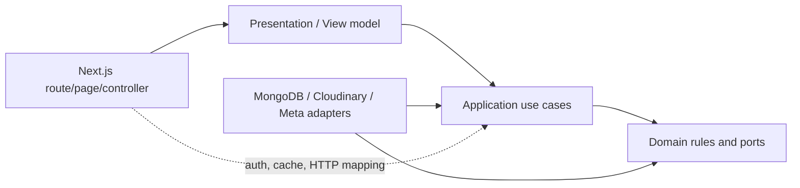

# Tiến Đạt Audio — Clean Architecture và UI Design Standard

**Trạng thái:** Proposed — áp dụng cho mọi module mới và mọi thay đổi lớn vào UI/content.

**Phạm vi:** Next.js App Router, React, MongoDB, Cloudinary, SEO/GEO/AIO, public website và admin CMS.

## 1. Quyết định nền tảng

### 1.1 Hai loại nội dung, một content domain

Website có hai trải nghiệm nhưng không được tạo hai nguồn dữ liệu trùng lặp:

- `editorial`: bài kiến thức dài, canonical tại `/kien-thuc/[slug]`.
- `social`: native post hoặc official Facebook embed, canonical tại `/bai-viet/[slug]`.

Collection `posts` dùng discriminator `contentType`. Các use case, validator và view model của hai loại được tách riêng; không ép social caption thành bài SEO dài và không làm mất dữ liệu editorial hiện tại.

`/kien-thuc` tiếp tục phục vụ long-form knowledge. `/bai-viet` là Social/Facebook Posts Hub theo design mới. Nếu sau này cần đổi tên hiển thị thành “Cộng đồng” hoặc “Góc Audio”, chỉ đổi label, không đổi canonical URL.

### 1.2 Native-first, embed là fallback

- Native Post là đường chính: nội dung, media, liên kết và quan hệ được lưu trên website.
- Facebook Embed chỉ dùng official embed của Meta cho trường hợp cần giữ nguyên nguồn gốc hoặc branding.
- Production không scrape Facebook, không giả lập giao diện official embed và không phụ thuộc Facebook SDK ở toàn site. Gallery worker chỉ là capability admin local opt-in: ưu tiên attach CDP vào Chrome đang mở để tạo một tab mới, đọc gallery rồi đóng đúng tab worker; không serialize token/cookie/profile vào API, file hoặc MongoDB. Fallback là profile Playwright tạm có thể nạp storage state local đã lọc chỉ còn Facebook cookie/localStorage và cho admin đăng nhập thủ công nếu session hết hạn. CDP/storage state chỉ được bật local, không chạy production/serverless; public/official embed và multi-upload là fallback khi chạy ngoài local.
- Import Facebook phải có bước preview và lựa chọn rõ ràng: lưu source URL/embed hoặc tạo native post để admin hoàn thiện thủ công.

### 1.3 MVP không tạo số liệu giả

Khi chưa có user account và nguồn integration hợp lệ:

- không lưu hoặc hiển thị reaction/comment/share count giả;
- `Share` dùng Web Share API trên mobile và copy link trên desktop;
- `Like` và `Comment` để disabled/ẩn ở MVP;
- nếu cần hiển thị số liệu Facebook, bắt buộc lưu `engagementSource` và nguồn/thời điểm đồng bộ.

### 1.4 Không big-bang rewrite

Các module hiện tại đang chạy được sẽ được giữ qua façade tương thích. Code mới đi vào `src/modules`; việc di chuyển `src/lib/*` chỉ thực hiện khi có test và không thay đổi contract public. Mỗi phase phải có đường rollback độc lập.

## 2. Dependency rule



Quy tắc bắt buộc:

| Layer | Được phép | Không được phép |
| --- | --- | --- |
| `domain` | TypeScript thuần, value object, invariant, pure function | React, Next.js, MongoDB, Cloudinary, `fetch`, cookie |
| `application` | Use case, port/interface, policy, DTO | JSX, `NextRequest`, `NextResponse`, gọi Mongo trực tiếp |
| `infrastructure` | Mongo repository, Cloudinary, Meta embed, cache adapter | Chứa business rule hoặc render UI |
| `presentation` | Server/Client Components, view model, interaction | Truy cập Mongo hoặc tự quyết định quyền truy cập |
| `app` | Route wiring, params, auth boundary, HTTP status, revalidation | Query DB, normalize document, business workflow dài |

Dependency chỉ đi từ ngoài vào trong. Domain không được import ngược `@/app`, `@/components` hoặc package hạ tầng.

## 3. Cấu trúc source đích

Không cần di chuyển toàn bộ source ngay lập tức. Đây là cấu trúc chuẩn cho code mới:

```text
src/
├── app/
│   ├── (site)/                 # page composition, giữ nguyên public URL
│   │   ├── page.tsx
│   │   ├── bai-viet/
│   │   │   ├── page.tsx
│   │   │   └── [slug]/page.tsx
│   │   └── ...
│   ├── admin/                  # admin route shell, không dùng site chrome
│   └── api/                    # thin HTTP controllers
├── modules/
│   ├── social/
│   │   ├── domain/
│   │   ├── application/
│   │   ├── infrastructure/
│   │   └── presentation/
│   ├── editorial/
│   ├── catalog/
│   ├── media/
│   ├── search/
│   ├── seo/
│   └── leads/
├── components/
│   ├── ui/                     # primitive dùng chung, không biết business
│   ├── layout/                 # header, footer, navigation, CTA shell
│   ├── social/                 # SocialFeed, PostCard, media renderer...
│   ├── catalog/
│   ├── editorial/
│   └── admin/
└── lib/
    ├── mongodb.ts              # shared connection only
    ├── auth.ts                 # session primitive only
    ├── admin-guard.ts
    └── compatibility/          # façade cho code cũ trong thời kỳ migration
```

### 3.1 Quy ước file

- `*.domain.ts`: entity/value object/invariant thuần.
- `*.ports.ts`: repository/service interface được application dùng.
- `*.use-case.ts`: một hành động nghiệp vụ, không chứa HTTP.
- `*.repository.ts`: port hoặc adapter phải đặt tên rõ (`SocialPostRepository`, `MongoSocialPostRepository`).
- `*.mapper.ts`: chuyển đổi giữa Mongo document, domain model và view model.
- `*.view-model.ts`: dữ liệu tối thiểu dành cho một màn hình; không truyền Mongo document vào JSX.
- Component interactive phải có hậu tố hoặc thư mục `client` khi cần; mặc định dùng Server Component.

Tên hàm phải mô tả hành động hoặc truy vấn: `listPublishedSocialPosts`, `publishSocialPost`, `restorePostRevision`; tránh tên mơ hồ như `getAll`, `handleData`, `updateAnything`.

## 4. Domain model chuẩn cho Social Post

Social Post là aggregate root. Các relation chỉ lưu stable IDs; không nhúng toàn bộ Product/Article vào post.

```ts
type ContentType = 'editorial' | 'social'
type SocialPostType = 'native' | 'facebook_embed'
type PostStatus = 'idea' | 'draft' | 'review' | 'scheduled' | 'published' | 'archived'

type SocialPost = {
  id: string
  contentType: 'social'
  postType: SocialPostType
  slug: string
  status: PostStatus
  author: { displayName: string; avatarUrl?: string; verified: boolean }
  text: string
  tags: string[]
  mentions: string[]
  links: LinkPreview[]
  media: MediaItem[]
  source: { facebookUrl?: string; facebookEmbedUrl?: string }
  relatedProductIds: string[]
  relatedArticleIds: string[]
  relatedProjectIds: string[]
  engagement?: EngagementSnapshot
  seo: SocialSEO
  publishedAt: string | null
  scheduledAt: string | null
  createdAt: string
  updatedAt: string
  version: number
}
```

### 4.1 Media contract

```ts
type MediaItem = {
  id: string
  type: 'image' | 'video' | 'youtube' | 'facebook'
  url: string
  thumbnailUrl?: string
  publicId?: string
  width?: number
  height?: number
  aspectRatio?: number
  alt: string
  order: number
}
```

Media metadata được embed trong post để publish là một thao tác atomic; binary/original nằm ở Cloudinary, không nằm trong Mongo. Khi cần media library/search riêng mới tách `media_assets`, không tạo trước khi có use case thật.

`alt` là bắt buộc với ảnh public. URL phải qua allowlist protocol/host. Video vertical không được ép thành 16:9; renderer dùng `aspectRatio` và max-width phù hợp.

### 4.2 Engagement provenance

```ts
type EngagementSnapshot = {
  source: 'facebook_sync' | 'manual_reference' | 'none'
  capturedAt: string
  likes?: number
  comments?: number
  shares?: number
}
```

`source: none` thì UI không render số. Không dùng field `likes: 128` không có provenance.

### 4.3 Invariant và state transition

Domain phải kiểm tra:

- slug normalized và unique qua repository;
- native post có `text` hoặc media;
- Facebook embed có URL hợp lệ trong allowlist;
- scheduled phải có `scheduledAt` ở tương lai;
- published phải có `publishedAt`;
- `relatedProductIds`, `relatedArticleIds`, `relatedProjectIds` không chứa chính nó và không trùng;
- archived không xuất hiện trong public query;
- version tăng monotonically, conflict trả mã `VERSION_CONFLICT`.

Không cho route handler tự sửa status bằng cách thay object tùy ý. Dùng use case `submitForReview`, `schedulePost`, `publishPost`, `archivePost` để state transition có thể test độc lập.

## 5. Persistence và migration

### 5.1 MongoDB

Collection hiện tại `posts` tiếp tục là source of truth. Bổ sung discriminator và index thay vì tạo collection song song cho cùng post:

- `posts`: `contentType`, `postType`, social payload, status, relation IDs, SEO.
- `post_revisions`: snapshot trước publish/update/restore.
- `social_taxonomies`: category slug/label/order/active nếu taxonomy cần admin quản lý.
- `site_settings`: business profile, SEO strategy và feature flags hiện hành.

Index tối thiểu:

- unique `{ slug: 1 }`;
- `{ contentType: 1, status: 1, publishedAt: -1 }`;
- `{ contentType: 1, category: 1, publishedAt: -1 }`;
- `{ relatedProductIds: 1 }`;
- text/search index cho title, text, tags và product fields theo khả năng Mongo hiện tại.

Public query luôn có `limit` cố định và cursor/page rõ ràng; không dùng `getPublicPosts(200)` làm cơ chế feed lâu dài.

### 5.2 Migration

Migration phải:

1. backup Mongo trước khi apply;
2. dry-run mặc định;
3. idempotent, chạy lại không tạo duplicate;
4. gắn `contentType: 'editorial'` cho record cũ khi thiếu discriminator;
5. không rewrite nội dung editorial đang live;
6. ghi count trước/sau và rollback reference;
7. chỉ apply production sau human gate.

Không xóa field legacy trong phase đầu. Mapper đọc được cả document cũ và document chuẩn mới; cleanup chỉ là phase riêng sau khi có đủ backup và audit.

## 6. Application/API boundary

### 6.1 Public query

Recommended contract:

- `GET /api/posts?category=&q=&page=&limit=`: dùng cho load more/search enhancement, không thay SSR initial page.
- `GET /api/posts/[slug]`: chỉ trả public view model; draft/archived trả `404`.
- Page route `/bai-viet` server-render page đầu và link pagination `/bai-viet?page=2`.

### 6.2 Admin mutation

Recommended contract:

- `GET/POST /api/admin/posts`;
- `GET/PUT /api/admin/posts/[id]`;
- `POST /api/admin/posts/[id]/review`;
- `POST /api/admin/posts/[id]/publish`;
- `POST /api/admin/posts/[id]/schedule`;
- `POST /api/admin/posts/[id]/archive`;
- `GET /api/admin/posts/[id]/revisions` và `POST .../restore`;
- `POST /api/admin/posts/import/facebook/preview`;
- `POST /api/admin/posts/import/facebook/native` chỉ tạo draft, không auto-publish.

Route handler chỉ làm bốn việc: parse request, `requireAdmin`, gọi use case, map typed error thành HTTP response. Validation untrusted input ở boundary; domain kiểm tra invariant lần hai.

### 6.3 Error contract

API thống nhất `{ success: false, code, message, fieldErrors? }`. Không trả stack trace, Mongo error hoặc secret. Các mã tối thiểu: `UNAUTHORIZED`, `VALIDATION_ERROR`, `NOT_FOUND`, `SLUG_CONFLICT`, `VERSION_CONFLICT`, `UNSUPPORTED_EMBED`, `MEDIA_INVALID`, `MONGODB_REQUIRED`.

## 7. Presentation và component architecture

### 7.1 Component tree

```text
components/social/
├── SocialFeed.tsx              # server composition
├── PostCard.tsx                # server, semantic article
├── PostHeader.tsx              # author/time/source
├── PostContent.tsx             # text/hashtags/see-more boundary
├── PostMedia.tsx               # media dispatcher
├── PostImageGrid.tsx           # 1/2/3/4/5+ layout
├── PostVideo.tsx               # uploaded/video ratio
├── PostLinkPreview.tsx
├── PostActions.tsx             # client: share/copy only at MVP
├── PostReactionSummary.tsx     # provenance-aware
├── PostLightbox.tsx             # client: keyboard/focus/swipe
├── FacebookEmbed.tsx            # client, lazy official embed only
├── RelatedProductAttachment.tsx
├── RelatedProjectAttachment.tsx
├── PostCategoryFilter.tsx
├── PostSkeleton.tsx
└── ShareButton.tsx
```

Client boundary chỉ đặt ở `PostActions`, `PostLightbox`, menu/filter cần state và editor. Post feed/detail, metadata, structured data và relation fetch giữ Server Component để giảm JS và bảo đảm crawlability.

### 7.2 UI states bắt buộc

Mọi màn hình phải có loading/skeleton, empty, error, unauthorized, conflict, success và disabled state phù hợp. Không dùng mock production data để lấp empty state.

### 7.3 Accessibility

- semantic `article`, `header`, `time`, `figure`, `nav`;
- ảnh có alt; video có controls và poster;
- lightbox có focus trap, `aria-modal`, ESC, previous/next keyboard và focus restore;
- menu, filter và action có accessible name;
- focus-visible rõ ràng, contrast đạt WCAG AA;
- `prefers-reduced-motion` tắt reveal/glow/scale không cần thiết;
- không autoplay audio/video có âm thanh.

## 8. Sonic Purity design tokens

Design system từ ZIP là nguồn tham chiếu. Token semantic là nguồn duy nhất trong code; component không tự rải mã màu mới.

### 8.1 Color

```css
--sonic-obsidian: #080808;
--sonic-canvas: #141313;
--sonic-surface: #111111;
--sonic-surface-raised: #1c1b1b;
--sonic-surface-high: #2b2a2a;
--sonic-text: #e5e2e1;
--sonic-text-strong: #f5f5f5;
--sonic-muted: #9ea2a2;
--sonic-subtle: #707474;
--sonic-line: rgba(229, 226, 225, 0.14);
--sonic-line-strong: rgba(229, 226, 225, 0.30);
--sonic-accent: #d4af37;
--sonic-accent-hover: #e5c45a;
```

Gold chỉ dành cho CTA chính, active state, verified/premium indicator và focus ring. Không dùng gold cho toàn bộ tiêu đề hoặc mọi link.

Media surfaces có contract riêng vì độ sáng của ảnh không thể suy ra từ Light/Dark mode:

```css
--sonic-media-text: #f7f7f7;
--sonic-media-text-muted: rgba(247, 247, 247, 0.76);
--sonic-media-line: rgba(255, 255, 255, 0.34);
```

Mọi text đặt trên ảnh dùng `sonic-media-surface` để giữ màu chữ độc lập với Light/Dark mode. Không thêm scrim ở global shell; một component-owned photographic card có thể dùng local scrim/contrast zone khi nội dung card cần bảo đảm WCAG và brief đã chỉ rõ, với token và selector scoped riêng. Ảnh và vị trí text phải được chọn có chủ đích; badge cần tách nền thì dùng surface đặc/solid token. Không đổi chữ trắng thành chữ đen theo theme và không dùng `mix-blend-mode: difference` cho heading/CTA chính.

### 8.2 Typography và layout

- Font chính: Manrope, đã có trong `next/font`.
- Display desktop 64px/1.1/800; headline 40px/1.2/700; body 16–18px/1.6.
- Mobile headline chính 32px/1.2; nội dung post ưu tiên 16px và line-height tối thiểu 1.6.
- Spacing theo 8px; desktop gutter 32px, outer margin 64px; mobile gutter 16–20px.
- Global container tối đa 1440px.
- Social feed center rộng 680–760px; desktop có sidebar trái/phải nhưng không làm post full-width.
- Card dùng surface + border 1px; không dùng shadow nặng và không scale cả card khi hover.
- Radius 8px cho control, 16px cho panel lớn, pill chỉ cho status/tag.

### 8.3 Motion

- Button/hover: 180–220ms.
- See more: height/opacity nhẹ, không reload.
- Lightbox: opacity + scale `0.98 → 1`, 200–300ms.
- Image hover chỉ opacity/scale nhẹ; không làm layout shift.
- Hero/glow có thể breathe chậm nhưng phải có reduced-motion fallback.

### 8.4 Light/Dark theme contract

Light Mode là capability bắt buộc của cả public website và admin, không phải một theme riêng chỉ dành cho một số page.

```ts
type ThemeMode = 'dark' | 'light' | 'system'
```

Quy tắc:

- Default giữ `dark` để bảo toàn nhận diện Sonic Purity hiện tại; user có thể chọn `light`, và `system` là option mở rộng nếu cần.
- Theme state dùng một provider/chính sách chung cho public, admin và admin login; không tạo hai cơ chế `ThemeContext` khác nhau.
- Persist preference bằng cookie không nhạy cảm để SSR chọn theme ngay từ request và `localStorage` để thao tác client; có inline bootstrap nhỏ nếu cần để tránh flash sai theme.
- Root dùng `data-theme="dark|light"`; không dùng class `dark` cố định làm nguồn sự thật duy nhất.
- Semantic token là API UI: `--sonic-canvas`, `--sonic-surface`, `--sonic-text`, `--sonic-muted`, `--sonic-line`, `--sonic-accent`, `--sonic-focus`. Component không viết `bg-[#080808]`, `text-[#e5e2e1]` hoặc màu dark tương đương trực tiếp.
- Public và admin dùng cùng semantic token nhưng có thể có surface-level override nhỏ; không được tạo palette admin thứ hai.
- User mode không ghi vào MongoDB và không cần đăng nhập. Admin có thể preview/đổi mode của chính session; thiết lập branding global chỉ là concern riêng, không được dùng preference cá nhân để đổi màu của mọi user.

Token light phải là warm-neutral premium, không phải đảo màu máy móc:

```css
[data-theme='light'] {
  --sonic-canvas: #f4f2ee;
  --sonic-surface: #fffdf9;
  --sonic-surface-raised: #ece9e2;
  --sonic-surface-high: #e3dfd6;
  --sonic-text: #1a1a19;
  --sonic-text-strong: #090909;
  --sonic-muted: #5f6360;
  --sonic-subtle: #727670;
  --sonic-line: rgba(26, 26, 25, 0.14);
  --sonic-line-strong: rgba(26, 26, 25, 0.30);
  --sonic-accent: #9a7100;
  --sonic-accent-hover: #765500;
}
```

Các component bắt buộc được kiểm tra ở cả hai mode: header/menu, footer/map, floating contact, form/input, button, card, table, toast, dialog, lightbox, video placeholder, admin sidebar/topbar, login và empty/error states. Accent light phải đạt contrast khi dùng làm text; CTA dùng text tối trên nền accent, không dùng text trắng mặc định.

Theme toggle phải có accessible name, `aria-pressed`/menu state, focus-visible, không reload trang và không làm layout shift. `prefers-reduced-motion` vẫn có hiệu lực độc lập với theme.

`src/contexts/ThemeContext.tsx` và `/api/admin/theme` hiện là legacy surface: chúng chỉ được giữ qua compatibility layer trong lúc migration; không mở rộng cơ chế lưu `data/theme.json` runtime cho Light Mode production. Theme tokens mới phải là versioned code/config immutable, còn user preference là cookie/localStorage.

## 9. Data safety, security và performance

- Admin mutation luôn qua `requireAdmin`, CSRF/session policy hiện hành và validator.
- Không render raw HTML/Markdown chưa sanitize.
- Link preview phải chống SSRF: chỉ `http/https`, timeout, giới hạn redirect/response, block private IP và sanitize title/description/image.
- Facebook/YouTube embed chỉ allowlist host và path; không nhận arbitrary iframe HTML từ admin.
- Upload giới hạn MIME, byte size, dimensions; Cloudinary là nơi lưu binary.
- Không load Facebook SDK trong root layout hoặc homepage. Embed dùng dynamic client component + lazy/in-viewport loading + placeholder.
- Dùng `next/image`, Cloudinary transformation, `sizes`, poster và thumbnail; không tải toàn bộ gallery khi chưa mở lightbox.
- Public list SSR page đầu, pagination/cursor cho phần còn lại; load more chỉ là enhancement.
- Analytics event phải tránh PII; lead attribution dùng UTM/referrer đã được normalize.

## 10. SEO/GEO/AIO contract

Native post public phải có:

- title, description, canonical, Open Graph image;
- `Article`/`BlogPosting` khi bản chất là bài viết;
- `VideoObject` chỉ khi có video thật và metadata đầy đủ;
- `BreadcrumbList`;
- `FAQPage` chỉ khi FAQ hiển thị thật trên page;
- không tạo `Review`, `AggregateRating` hoặc reaction schema giả.

Publish/update phải revalidate `/`, `/bai-viet`, detail, sitemap, RSS và `/llms.txt`. Draft/archived/embed placeholder không được lọt vào public discovery output nếu chưa publish.

Internal links dùng stable relation IDs để nối Social Post → Product → Article → Category/Brand → Lead CTA. Không dùng text matching ngẫu nhiên làm quan hệ chính.

## 11. Testing standard

### Unit

- normalize/validate post, media và URL;
- state transition và conflict/version;
- image-grid layout mapping 1/2/3/4/5+;
- slug/canonical/SEO defaults;
- structured data không tạo schema không có bằng chứng.

### API/integration

- admin auth/unauthorized;
- native/embed validation;
- publish/schedule/archive/restore;
- slug conflict và optimistic concurrency;
- migration dry-run/idempotency/index;
- public draft exclusion và pagination.

### Browser/visual

- desktop feed, mobile feed, post detail;
- see more, lightbox keyboard/ESC/swipe, share/copy;
- Facebook embed lazy load và failure placeholder;
- admin create → save → preview → schedule/publish → public detail;
- không có console error, horizontal overflow hoặc CTA che nội dung mobile.

### CI/release

`secret scan → dependency audit → unit/API tests → typecheck → lint → build → browser smoke`; production dùng immutable release, healthcheck, backup trước migration và rollback reference.

## 12. Definition of done cho module mới

Một module chỉ được coi là hoàn thành khi:

1. có domain contract và application use case;
2. route/API không chứa business logic hoặc DB query trực tiếp;
3. validation/auth/error contract đầy đủ;
4. UI có responsive/accessibility/loading/empty/error states;
5. không có mock production data hoặc nguồn dữ liệu thứ hai;
6. có migration/index/backup plan nếu đụng Mongo;
7. có unit test và browser smoke phù hợp;
8. SEO/cache/revalidation được kiểm tra;
9. worklog và rollback reference đã append;
10. public và admin được kiểm tra ở dark/light mode, gồm persistence, no-flash và contrast;
11. release chỉ triển khai sau human gate với evidence xanh.
